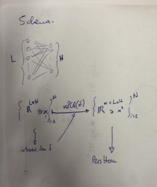
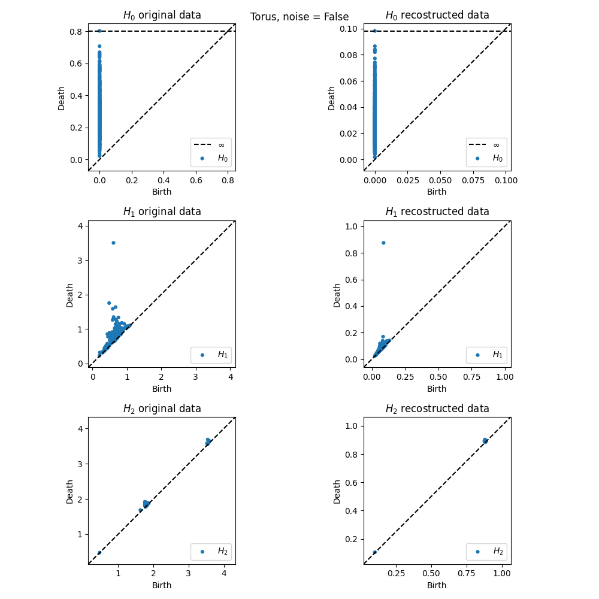
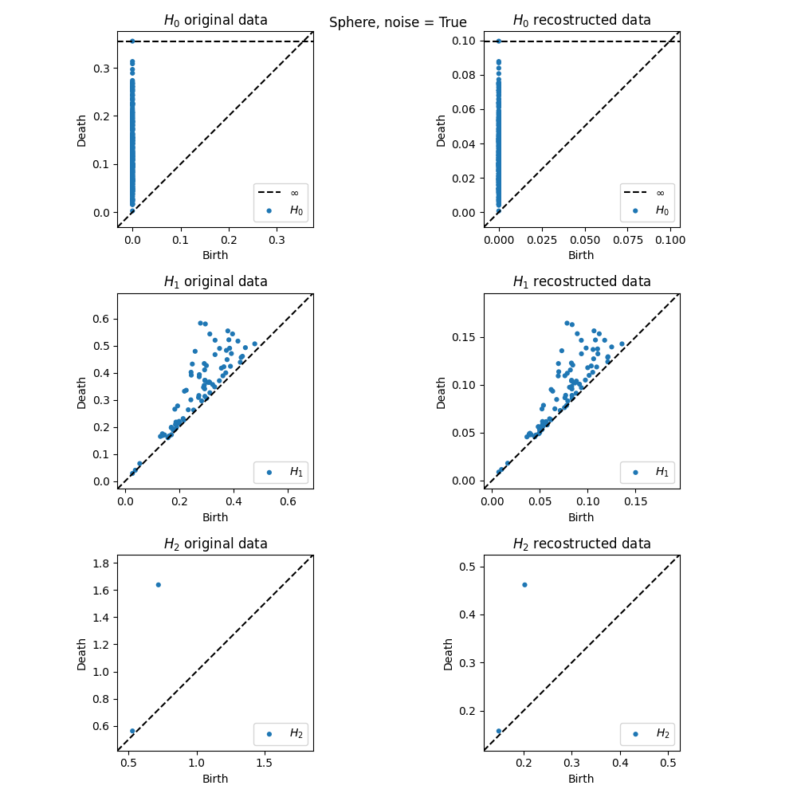
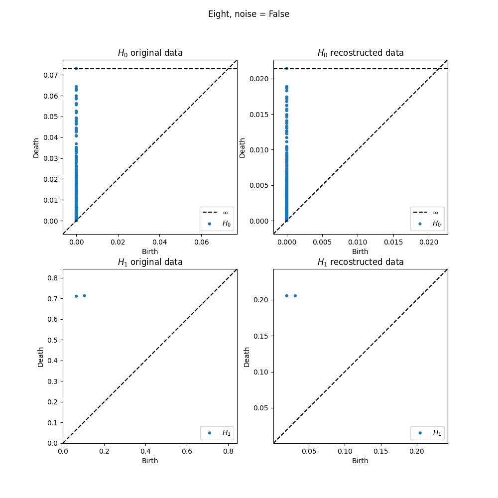

# PersHomEmbProj
Persistent Homology invariance under embedding and projection.

I try to ask the following.
Given a dataset $M$, it is well known that it is possible to associate its persistent homology diagrams, say for $H_0$, $H_1$ and $H_2$.

Suppose we want to embed our dataset in a higher dimensional space. A trivial way to do it to simply add $0$ coordinates to each points of $M$; another option is to randomly choose number within, for example, minimum and maximum values in $M$.

Once we have this embedding, we also have a new dataset, say $M'$. The question is: if we 'come back' to the initial dimension (kernelPCA), can we retrieve the persistent diagrams we had for $M$?

Formally:
let $M \subset \mathbb{R}^{N \times d}$,  $M' \subset \mathbb{R}^{N \times D}$,  $M'' \subset \mathbb{R}^{N \times d}$ wehere $N=$ number of points, $d=$ original dimension of the dataset, $D=$ dimension of the embedding space.

After the following maps

$$ M \xrightarrow{\text{embedding}} M' \xrightarrow{\text{kernelPCA}} M'' $$

is it true that PersistenDiagrams($M$) ~ PersistenDiagrams($M''$)?

**Why do we care about this?**

Note, if the above mentioned is true, this means that persistent diagrams are insensible to higher dimenisonal embedding. In particular,suppose we have a high dimensional dataset: using its intrinsic dimension, we obtain somehow a new dataset with same "geometrical properties" of the initial one, meaning that the other dimensions where "noise".

Now, we can perform kernelPCA on the initial dataset, projecting onto "principal components"="intrinsic dimension", and study the persistent diagrams of this new "smaller" space.

Scheme:

## Some results
The code for the following plots is [here](study_PersHom.ipynb). \
Following plot shows persistent diagram in different configuration of noise, with different manifolds. 20 extra dimensions were added in the embedding phase.

## Other notebooks in this repository
[hyper_sphere.ipynb](hyper_sphere.ipynb): study on lower dimensional homology group of the PCA projection of an hyper-sphere.

[example_pers_hom.ipynb](example_pers_hom.ipynb): notebook with many example of `ripser` and `gudhi` libraries to compute persistence homology diagrams and barcodes. It also provides example for using `Kepler Mapper` library to execute mapper algorithm. [This](make_circles_keplermapper_output.html) is an example of the output graph obtained using `Kepler Mapper` library.

[Here](src/) you can find two classes: \
- [PHomClass.py](src/PHomClass.py) is a class that performs persistent homology-based dimensionality reduction using PCA or kernel PCA. It allows for embedding the data by adding dimensions and reconstructing the data using PCA or kernel PCA. The class also computes the persistence diagrams for both the original and reconstructed data. Finally, it provides methods to visualize the persistence diagrams.

- [ShapeClass.py](src/ShapeClass.py) is a class for shapes generation as point cloud and plotting.
